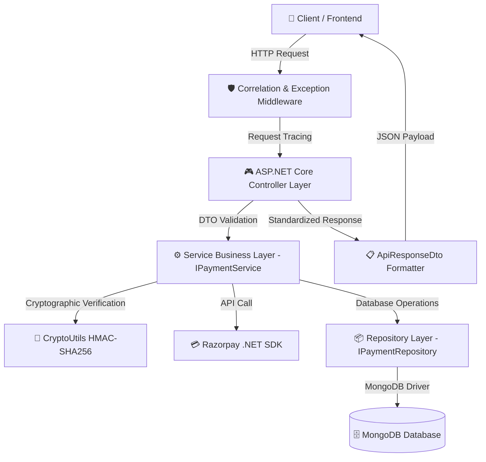
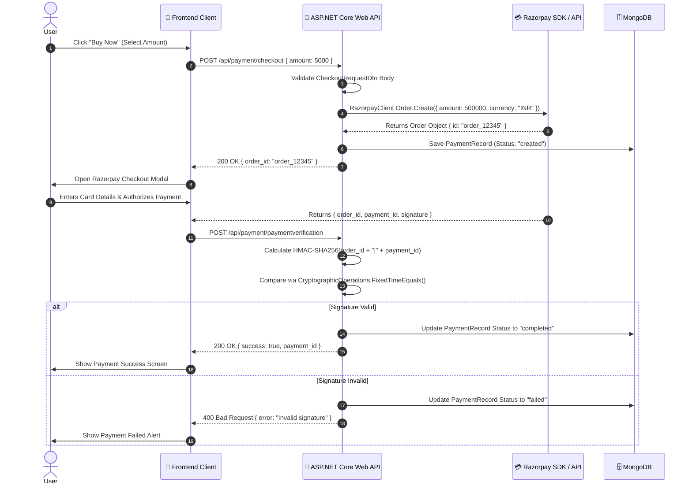

# 💳 Razorpay Payment Gateway — Enterprise ASP.NET Core & Node.js Architecture

[](https://dotnet.microsoft.com/)
[](https://nodejs.org/)
[](https://expressjs.com/)
[](https://mongoosejs.com/)
[](https://razorpay.com/)
[]()

An **enterprise-grade, production-ready payment gateway architecture** supporting both **ASP.NET Core 8/10 Web API** and **Node.js Express** backends for payment processing using the Razorpay SDK. Designed following **Clean Architecture**, **SOLID principles**, and **Senior Engineering best practices**.

---

## 🏛️ ASP.NET Core Clean Architecture Overview

The ASP.NET Core Web API backend (`/dotnet-server`) is built with strict C# compile-time safety and native framework abstractions:

1. **Clean / Layered Architecture**:
   - `Controllers` $\rightarrow$ `Services (Interfaces & Implementations)` $\rightarrow$ `Repositories (DAO)` $\rightarrow$ `MongoDB Driver / SDK`.
2. **Built-in Dependency Injection**:
   - Service container registration via `IServiceCollection` (`AddScoped<IPaymentService, PaymentService>()`).
3. **Cryptographic Security & Timing-Safe Verification**:
   - Uses `CryptographicOperations.FixedTimeEquals` for HMAC-SHA256 signature verification in `CryptoUtils.cs` to eliminate side-channel timing attack vectors.
4. **Idempotent Webhook Engine**:
   - Handles asynchronous Razorpay event notifications (`payment.captured`, `payment.failed`, `order.paid`) while logging event IDs to prevent duplicate webhook processing.
5. **Global Exception Handling Middleware**:
   - Custom `GlobalExceptionMiddleware` mapping operational exceptions (`AppException`, `BadRequestException`, `PaymentVerificationException`) to standardized JSON responses.
6. **OpenAPI / Swagger Integration**:
   - Integrated Swashbuckle OpenAPI UI accessible at `/swagger`.

---

## 📊 Visual Mermaid Diagrams

### 1. ASP.NET Core Enterprise System Architecture



---

### 2. Payment Checkout & Cryptographic Verification Sequence



---

## 📁 Repository Directory Structure

```text
payment-gateway/
├── README.md                            # Complete System Documentation
├── dotnet-server/                       # ASP.NET Core 8/10 Web API Backend
│   ├── PaymentGateway.Api.csproj        # C# Project File (Razorpay, MongoDB.Driver, Swashbuckle)
│   ├── Program.cs                       # Web Application Builder, DI Registration, CORS & Middleware
│   ├── appsettings.json                 # ASP.NET Core App Settings
│   ├── Config/
│   │   ├── MongoDbSettings.cs           # MongoDB Configuration Options
│   │   └── RazorpaySettings.cs          # Razorpay Settings Options
│   ├── Controllers/
│   │   ├── HealthController.cs          # Diagnostic Probe Controller (/api/health)
│   │   ├── PaymentController.cs         # Payment HTTP Endpoints (/api/payment)
│   │   └── WebhookController.cs         # Razorpay Webhook Event Receiver (/api/webhook)
│   ├── DTOs/
│   │   ├── ApiResponseDto.cs            # Generic Standardized API Response Wrapper
│   │   └── PaymentDTOs.cs               # Checkout & Verify Payment Request DTOs
│   ├── Middleware/
│   │   ├── GlobalExceptionMiddleware.cs # Global Exception Handling Middleware
│   │   └── RequestCorrelationMiddleware.cs # Correlation ID Injector Middleware
│   ├── Models/
│   │   └── Models.cs                    # PaymentRecord & Product MongoDB BSON Entities
│   ├── Repositories/
│   │   ├── PaymentRepository.cs         # Payment Data Access Interface & Repository
        └── ProductRepository.cs         # Product Data Access Interface & Repository
│   ├── Services/
│   │   ├── PaymentService.cs            # Payment Domain Business Logic & Razorpay SDK Client
│   │   ├── ProductService.cs            # Product Catalog Service
│   │   └── WebhookService.cs            # Idempotent Webhook Event Processor
│   └── Utilities/
│       ├── CryptoUtils.cs               # Timing-Safe HMAC-SHA256 Verification
│       └── CustomExceptions.cs          # Custom Operational Exceptions
└── server/                              # Node.js Express Backend (Modular Clean Architecture)
```

---

## 💻 Running the ASP.NET Core Backend

```bash
# Navigate to dotnet-server directory
cd payment-gateway/dotnet-server

# Build the ASP.NET Core project
dotnet build

# Run the ASP.NET Core Web API server
dotnet run
```

Access Swagger UI Documentation at: `http://localhost:5000/swagger` or `http://localhost:5163/swagger`.

---

## 👨‍💻 Author
**Saurabh Singh Rajput**  
MERN / .NET Stack Developer | IIIT Bhagalpur  
GitHub: [@DevSars24](https://github.com/DevSars24)
