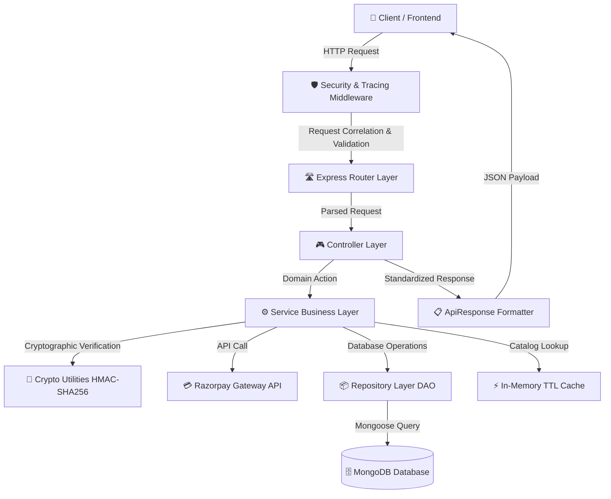
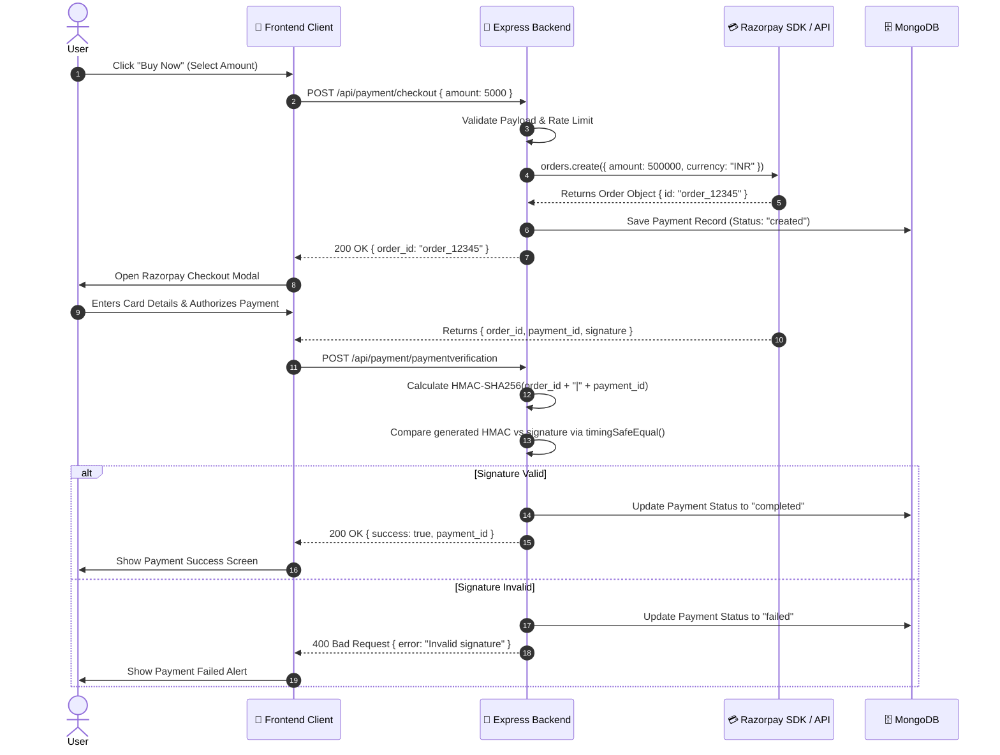
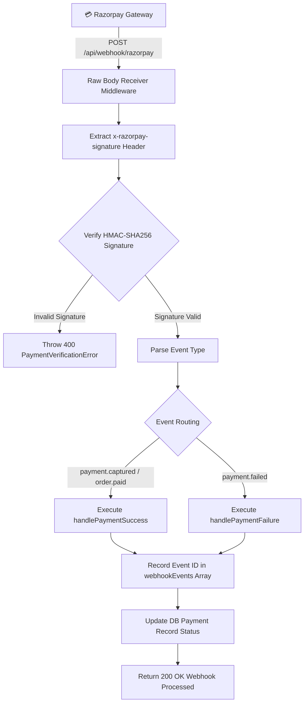

# 💳 Razorpay Payment Gateway — Senior Enterprise Backend Architecture

[](https://nodejs.org/)
[](https://expressjs.com/)
[](https://mongoosejs.com/)
[](https://razorpay.com/)
[]()

An **enterprise-grade, production-ready backend architecture** built with Node.js, Express, and MongoDB for payment processing using the Razorpay SDK. Designed following **Clean Architecture**, **SOLID principles**, and **Senior Engineering best practices**.

---

## 🏛️ Architectural Overview & Design Patterns

This system moves away from monolithic or tightly-coupled scripts and enforces strict separation of concerns across multiple application layers:

1. **Clean / Layered Architecture**:
   - `Routes` $\rightarrow$ `Middleware` $\rightarrow$ `Controllers` $\rightarrow$ `Services` $\rightarrow$ `Repositories (DAO)` $\rightarrow$ `Database / SDKs`.
2. **Repository / DAO Pattern**:
   - Decouples business logic from Mongoose ORM/database queries.
3. **Cryptographic Security & Timing-Safe Verification**:
   - Uses `crypto.timingSafeEqual` for HMAC-SHA256 signature verification to eliminate side-channel timing attack vectors on payment/webhook verification.
4. **Idempotent Webhook Processing**:
   - Handles asynchronous Razorpay event notifications (`payment.captured`, `payment.failed`) while preventing duplicate event execution via event tracking logs.
5. **Centralized Operational Error Handling**:
   - Custom `AppError` class hierarchy (`BadRequestError`, `NotFoundError`, `PaymentVerificationError`, `InternalServerError`) managed by a unified Express error middleware.
6. **Distributed Tracing & Structured Logging**:
   - Attaches a unique Correlation ID (`X-Correlation-ID`) to every incoming HTTP request and outputs JSON-formatted logs with timestamps and severity levels (`INFO`, `WARN`, `ERROR`, `DEBUG`).
7. **Resilient Database Management**:
   - MongoDB connection pooling, connection event monitoring, auto-reconnection listeners, and graceful shutdown handlers (`SIGINT`/`SIGTERM`).
8. **Performance Optimization & Caching**:
   - In-memory TTL Cache provider for read-heavy operations like product catalogs.
9. **Differentiated Rate Limiting & HTTP Hardening**:
   - Helmet security headers + strict endpoint rate limiting for checkout and verification to prevent brute-force attacks.

---

## 📊 Visual Mermaid Diagrams

### 1. System Architecture & Layer Flow



---

### 2. Payment Checkout & Cryptographic Verification Sequence



---

### 3. Asynchronous Webhook Event Processing Pipeline



---

## 📁 Repository Directory Structure

```text
payment-gateway/
├── README.md                          # Production Architecture & System Documentation
└── server/
    ├── app.js                         # Main Express application configuration & pipeline setup
    ├── server.js                      # HTTP server bootstrapping, database init & process signal traps
    ├── database.js                    # Legacy database export re-exporter
    ├── package.json                   # Project manifest & dependency declarations
    ├── config/
    │   └── config.env                 # Environment variables configuration file
    ├── controllers/
    │   └── paymentController.js       # Legacy controller export wrapper
    ├── models/
    │   └── paymentModel.js            # Legacy model export wrapper
    ├── routes/
    │   └── paymentRoute.js            # Legacy router export wrapper
    └── src/                           # Enterprise Modular Source Directory
        ├── config/
        │   ├── database.js            # Database Connection Manager (Pools, Reconnects, Shutdown)
        │   ├── env.js                 # Environment variables loader & validator
        │   └── razorpay.js            # Razorpay SDK Singleton Client Factory
        ├── controllers/
        │   ├── healthController.js    # Health check & system diagnostic probe handler
        │   ├── paymentController.js   # Payment HTTP endpoint handlers
        │   └── webhookController.js   # Razorpay webhook event HTTP handler
        ├── middleware/
        │   ├── errorHandler.js        # Global Express exception & error sanitizer middleware
        │   ├── rateLimiter.js         # General and Strict Payment Rate Limiters
        │   ├── requestLogger.js       # Correlation ID injector & request performance timer
        │   └── requestValidator.js    # Request body schema validation middleware
        ├── models/
        │   ├── paymentModel.js        # Mongoose Schema with indexes, status enums & methods
        │   └── productModel.js        # Mongoose Schema for product catalog inventory
        ├── repositories/
        │   ├── paymentRepository.js   # Data Access Object (DAO) for Payment database queries
        │   └── productRepository.js   # Data Access Object (DAO) for Product database queries
        ├── routes/
        │   ├── healthRoute.js         # Health check diagnostic route definitions
        │   ├── paymentRoute.js        # Payment & checkout API route definitions
        │   └── webhookRoute.js        # Razorpay asynchronous webhook route definitions
        ├── services/
        │   ├── paymentService.js      # Business domain logic for orders, keys & verification
        │   ├── productService.js      # Product catalog service with TTL caching integration
        │   └── webhookService.js      # Idempotent webhook event processor & signature validator
        └── utils/
            ├── ApiResponse.js         # Standardized JSON response formatting helper
            ├── AppError.js            # Custom Operational Exception hierarchy classes
            ├── asyncHandler.js        # Higher-order async exception wrapper for controllers
            ├── cache.js               # In-Memory TTL Cache Manager
            ├── cryptoUtils.js         # Timing-safe HMAC-SHA256 signature verification utility
            └── logger.js              # Structured enterprise logging utility
```

---

## 🔍 Detailed File & Concept Breakdown

### 🛠️ Core Server Files

#### 1. [`server/server.js`](file:///c:/Users/DELL/Desktop/Razorpay/payment-gateway/server/server.js)
- **Concept**: Server lifecycle management, environment bootstrap, database connection initialization, and process-level signal handling.
- **Key Features**:
  - Catches `uncaughtException` (synchronous crashes) and `unhandledRejection` (unhandled Promises).
  - Traps `SIGINT` (Ctrl+C) and `SIGTERM` (Docker/Kubernetes termination) to run `gracefulShutdown()`, draining active HTTP connections and closing MongoDB handles cleanly before exit.

#### 2. [`server/app.js`](file:///c:/Users/DELL/Desktop/Razorpay/payment-gateway/server/app.js)
- **Concept**: Central Express HTTP request pipeline setup.
- **Key Features**:
  - Configures `helmet()` for HTTP security headers.
  - Configures `cors()` with origin validation.
  - Attaches `requestLogger` for correlation tracking and `globalRateLimiter` for DDoS protection.
  - Configures `express.json` with a custom `verify` handler to preserve raw request bytes (`req.rawBody`) needed for cryptographic webhook signature verification.
  - Mounts routers and handles 404 unknown routes with `NotFoundError`.
  - Registers `globalErrorHandler` as the final middleware.

---

### ⚙️ Configuration Layer (`src/config/`)

#### 3. [`server/src/config/env.js`](file:///c:/Users/DELL/Desktop/Razorpay/payment-gateway/server/src/config/env.js)
- **Concept**: Environment variable validation and configuration sanitization.
- **Key Features**: Parses `config.env`, sets sensible defaults, and issues warnings during server startup if key credentials (`RAZORPAY_KEY_ID`, `RAZORPAY_KEY_SECRET`) are missing.

#### 4. [`server/src/config/database.js`](file:///c:/Users/DELL/Desktop/Razorpay/payment-gateway/server/src/config/database.js)
- **Concept**: Database Connection Manager class for MongoDB.
- **Key Features**: Configures connection pools (`maxPoolSize: 10`), handles reconnection events (`disconnected`, `reconnected`), listens to connection errors, and exposes a clean `disconnect()` method.

#### 5. [`server/src/config/razorpay.js`](file:///c:/Users/DELL/Desktop/Razorpay/payment-gateway/server/src/config/razorpay.js)
- **Concept**: Singleton factory for Razorpay SDK initialization.
- **Key Features**: Guarantees a single re-usable Razorpay client instance across the application lifecycle.

---

### 🛡️ Utility & Security Layer (`src/utils/`)

#### 6. [`server/src/utils/AppError.js`](file:///c:/Users/DELL/Desktop/Razorpay/payment-gateway/server/src/utils/AppError.js)
- **Concept**: Operational vs. Programmatic Error separation.
- **Key Features**: Custom `AppError` base class extending native `Error` with HTTP status codes and operational flags. Includes specialized sub-classes: `BadRequestError`, `UnauthorizedError`, `NotFoundError`, `PaymentVerificationError`, `InternalServerError`.

#### 7. [`server/src/utils/ApiResponse.js`](file:///c:/Users/DELL/Desktop/Razorpay/payment-gateway/server/src/utils/ApiResponse.js)
- **Concept**: JSend-compliant unified API response contract.
- **Key Features**: Formats every HTTP response consistently: `{ success, statusCode, message, data, meta, timestamp }`.

#### 8. [`server/src/utils/asyncHandler.js`](file:///c:/Users/DELL/Desktop/Razorpay/payment-gateway/server/src/utils/asyncHandler.js)
- **Concept**: Higher-Order Function (HOF) wrapper for async Express controllers.
- **Key Features**: Automatically passes rejected promises to `next(err)`, avoiding boilerplate `try { ... } catch (err) { next(err); }` in every controller.

#### 9. [`server/src/utils/cryptoUtils.js`](file:///c:/Users/DELL/Desktop/Razorpay/payment-gateway/server/src/utils/cryptoUtils.js)
- **Concept**: Cryptographic security & side-channel attack prevention.
- **Key Features**:
  - Generates HMAC-SHA256 hex signatures.
  - Implements constant-time comparison via `crypto.timingSafeEqual()` to protect signature verification against timing attacks.

#### 10. [`server/src/utils/logger.js`](file:///c:/Users/DELL/Desktop/Razorpay/payment-gateway/server/src/utils/logger.js)
- **Concept**: Structured logging system.
- **Key Features**: Supports log levels (`INFO`, `WARN`, `ERROR`, `DEBUG`), attaches timestamps, and outputs formatted JSON with correlation IDs.

#### 11. [`server/src/utils/cache.js`](file:///c:/Users/DELL/Desktop/Razorpay/payment-gateway/server/src/utils/cache.js)
- **Concept**: In-memory TTL Cache manager.
- **Key Features**: Key-value cache with expiration timestamps and background memory cleanup timers for fast catalog lookup.

---

### 🛡️ Middleware Layer (`src/middleware/`)

#### 12. [`server/src/middleware/errorHandler.js`](file:///c:/Users/DELL/Desktop/Razorpay/payment-gateway/server/src/middleware/errorHandler.js)
- **Concept**: Centralized exception handler and error sanitizer.
- **Key Features**: Handles operational errors, Mongoose schema validation errors, duplicate key errors (code 11000), and hides internal error stack traces in production.

#### 13. [`server/src/middleware/requestLogger.js`](file:///c:/Users/DELL/Desktop/Razorpay/payment-gateway/server/src/middleware/requestLogger.js)
- **Concept**: Request correlation tracing and execution timing.
- **Key Features**: Reads or generates `X-Correlation-ID` header and logs request completion time upon HTTP response finish.

#### 14. [`server/src/middleware/requestValidator.js`](file:///c:/Users/DELL/Desktop/Razorpay/payment-gateway/server/src/middleware/requestValidator.js)
- **Concept**: Request payload schema validator.
- **Key Features**: Validates required fields, data types, and numeric constraints before hitting controllers.

#### 15. [`server/src/middleware/rateLimiter.js`](file:///c:/Users/DELL/Desktop/Razorpay/payment-gateway/server/src/middleware/rateLimiter.js)
- **Concept**: Rate limiting & brute-force defense.
- **Key Features**: Exports `globalRateLimiter` (100 req/15 min) and `paymentRateLimiter` (20 req/15 min).

---

### 🗄️ Models & Data Access Layer (`src/models/` & `src/repositories/`)

#### 16. [`server/src/models/paymentModel.js`](file:///c:/Users/DELL/Desktop/Razorpay/payment-gateway/server/src/models/paymentModel.js)
- **Concept**: MongoDB Payment Schema definition.
- **Key Features**: Includes compound indexes (`status: 1, createdAt: -1`), status enums (`created`, `processing`, `completed`, `failed`), instance methods (`markCompleted`, `markFailed`), and an audit list for processed webhooks.

#### 17. [`server/src/repositories/paymentRepository.js`](file:///c:/Users/DELL/Desktop/Razorpay/payment-gateway/server/src/repositories/paymentRepository.js)
- **Concept**: Data Access Object (DAO) isolating Mongoose logic.
- **Key Features**: Encapsulates DB queries (`create`, `findByOrderId`, `updateStatus`, `recordWebhookEvent`, `findAll` with pagination).

---

### ⚙️ Services Layer (`src/services/`)

#### 18. [`server/src/services/paymentService.js`](file:///c:/Users/DELL/Desktop/Razorpay/payment-gateway/server/src/services/paymentService.js)
- **Concept**: Core Payment Domain Orchestrator.
- **Key Features**:
  - Creates orders with Razorpay API (converting INR to paise sub-units).
  - Persists initial payment records.
  - Verifies payment signatures using `CryptoUtils`.

#### 19. [`server/src/services/webhookService.js`](file:///c:/Users/DELL/Desktop/Razorpay/payment-gateway/server/src/services/webhookService.js)
- **Concept**: Asynchronous Webhook Processor.
- **Key Features**: Verifies webhook HMAC signatures from raw bodies and updates payment states idempotently.

---

### 🎮 Controllers & Routes Layer (`src/controllers/` & `src/routes/`)

#### 20. [`server/src/controllers/paymentController.js`](file:///c:/Users/DELL/Desktop/Razorpay/payment-gateway/server/src/controllers/paymentController.js)
- **Concept**: Thin HTTP handler layer.
- **Key Features**: Extracts parameters from `req.body`/`req.query`, delegates execution to services, and returns unified `ApiResponse` payloads.

#### 21. [`server/src/controllers/healthController.js`](file:///c:/Users/DELL/Desktop/Razorpay/payment-gateway/server/src/controllers/healthController.js)
- **Concept**: System diagnostic & readiness probe handler.
- **Key Features**: Returns MongoDB connection status, process uptime, memory consumption, and Node version.

---

## 📡 API Specification & Reference

### 1. System Health Probe
- **`GET /api/health`**
- **Response**:
```json
{
  "success": true,
  "statusCode": 200,
  "message": "System health status",
  "data": {
    "status": "UP",
    "services": { "database": "UP" },
    "system": { "uptimeSeconds": 142, "memory": { "heapUsedMB": "28.4" } }
  }
}
```

### 2. Fetch Razorpay API Key
- **`GET /api/payment/getkey`**
- **Response**: `{ "success": true, "data": { "key": "rzp_test_..." } }`

### 3. Initiate Checkout Order
- **`POST /api/payment/checkout`**
- **Headers**: `Content-Type: application/json`
- **Body**:
```json
{
  "amount": 5000
}
```
- **Response**:
```json
{
  "success": true,
  "message": "Payment order created successfully",
  "data": {
    "order": {
      "id": "order_P1X2Y3Z4",
      "entity": "order",
      "amount": 500000,
      "currency": "INR",
      "receipt": "receipt_1700000000_123"
    }
  }
}
```

### 4. Verify Payment Signature
- **`POST /api/payment/paymentverification`**
- **Body**:
```json
{
  "razorpay_order_id": "order_P1X2Y3Z4",
  "razorpay_payment_id": "pay_Q5R6S7T8",
  "razorpay_signature": "a1b2c3d4e5..."
}
```
- **Response**: `{ "success": true, "message": "Payment signature verified successfully" }`

### 5. Asynchronous Webhook Receiver
- **`POST /api/webhook/razorpay`**
- **Headers**: `x-razorpay-signature: <HMAC_SIGNATURE>`

---

## 💻 Environment Variables Setup

Create `config.env` in `/server/config/config.env`:

```env
PORT=4000
NODE_ENV=development
MONGO_URI=mongodb://localhost:27017/payment_gateway
RAZORPAY_KEY_ID=your_razorpay_key_id
RAZORPAY_KEY_SECRET=your_razorpay_key_secret
RAZORPAY_WEBHOOK_SECRET=your_webhook_secret
CLIENT_ORIGIN=http://localhost:3000
```

---

## 🚀 Running the Server Locally

```bash
# Navigate to server directory
cd payment-gateway/server

# Install dependencies
npm install

# Run syntax verification check
node --check server.js

# Start server in development mode
npm run dev
```

---

## 👨‍💻 Author
**Saurabh Singh Rajput**  
MERN Stack Developer | IIIT Bhagalpur  
GitHub: [@DevSars24](https://github.com/DevSars24)
